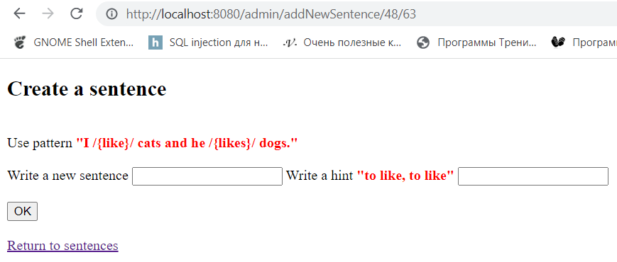
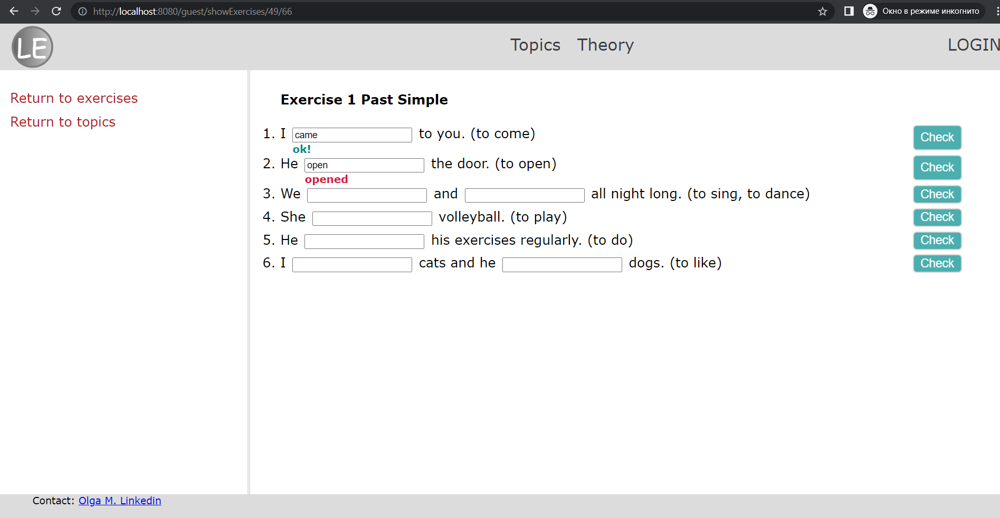

##About the project

This project is a prototype site for learning English grammar.
The functionality of the site is divided into administrator `/admin/**`
and guest `/guest/**`.

The administrator has the ability to create new topics, sentences and relevant exercises. The administrator has a username and password
to access `/admin/**`. 

You can find username and password in class **WebSecurityConfigAdapter**.

The user has access to perform and check exercises
without registration and SMS =).

##Technologies
The site was created in Java using
**Spring MVC + Hibernate MySQL + Spring Security**.
Configuration method - JavaConfig.

All program settings (configuration) are located in the package "configuration".

##How to run the project
1. Database dump is named `my_db_fp_english_exercises` and it
is placed at the root of a project.
Before starting the program, you need MySQL configured and database created.
2. According to the screenshot, change the following data
in the class HibernateConfig.java: 

    (1) - your MySQL port;
    
    (2) - your MySQL username;
    
    (3) - your MySQL password;

3. The project can be launched in IntelliJ IDEA,
for this you need to connect **Smart Tomcat**.

##How to use the project

### For administrator:

After the project is launched and opened in the browser add `/admin` path in the address bar.

You will be redirected to the authorization page.
Please type the required login and password specified in a class **WebSecurityConfigAdapter**.

On "Topic list" page you can add new topic (Add button),
change topic name (Update button), delete topic (Delete button),
log out of your account (Logout link).

---

To go to the page with exercises, you need to click on the topic
(for example Present Simple).
After clicking, a page "Exercise list" will appear. It that is identical
in structure to the page described above.

---
To go to the page with sentences, you need to click on the exercise
(for example Exercise 1 Present Simple).
After clicking, a page "Sentence list" will appear. It that is identical
in structure to the page described above.

---
To create a sentence, you need to use the pattern.
The word that the user will have to write
must be enclosed in special characters /{word}/.
In the second field you need to enter a hint.

---

### For guest:

Click on the link "Guest" and go to the page with a choice of topics,
then select one of them and start doing the exercises.

Fill in the empty field with your answer, click the "check" button.
If the entered answer is correct, then you will see the blue inscription "ok!",
otherwise the correct solution will be shown in red.

